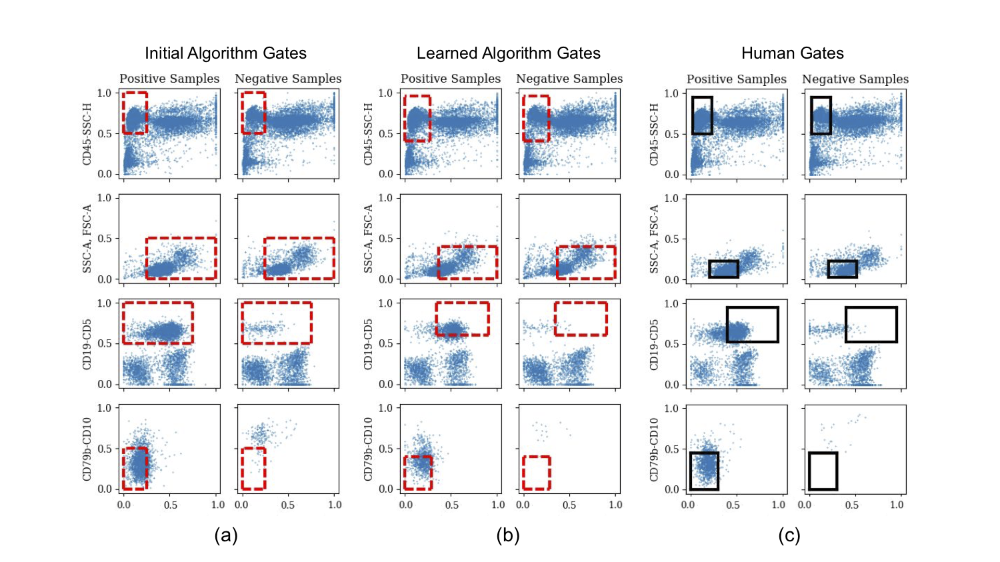
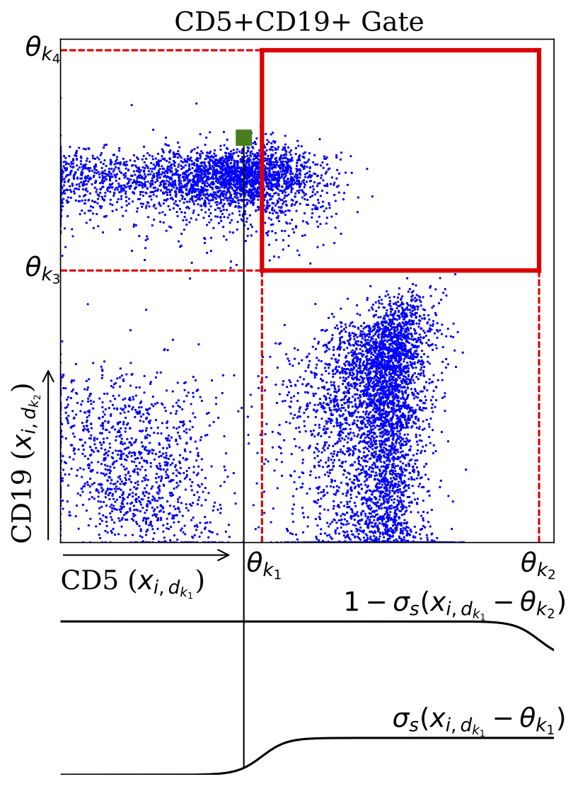

# Machine Learning of Discriminative Gate Locations for Clinical Diagnosis

This repository contains an implementation of the disciminative automated gating algorithms for flow cytometry data described in our paper: 
[Machine Learning of Discriminative Gate Locations for Clinical Diagnosis](https://onlinelibrary.wiley.com/doi/full/10.1002/cyto.a.23906)
(Disi Ji, Preston Putzel, Yu Qian, Ivan Chang, Aishwarya Mandava, Richard H. Scheuermann, Jack D. Bui, Huan‐You Wang and Padhraic Smyth)

<!--<p align="center">-->
  <!---->
<!--</p>-->

<p align="center">
  
</p>

## Dependencies
To install dependencies in `requirements.txt`:
```
pip3 install -r requirements.txt
```


## How to run the code
We evaluate the proposed approach using both simulated and real data, 
producing classification results on par with those generated via human expertise, 
in terms of both thepositions of the gating boundaries and the diagnostic accuracy.

To run our code:

1. Download the data from the following links:
    * [Panel1 data](https://flowrepository.org/id/FR-FCM-Z27S)
    * [Panel2 data](https://flowrepository.org/id/FR-FCM-Z27T)
2. Create a directory labelled cll inside of the data directory
3. Move the data folders from step one into the cll directory from step 2.
4. To use non-default settings for an experiment, modify the config file with the matching name as the main you would like to run, otherwise just run the desired main from the command line while in the src directory..


For example to run experiments using only one panel with default settings follow steps 1-3, navigate to the src directory and enter:

```
python main_1p.py
```

To use non-default settings for the panel one experiments, modify the default_1p.yaml file (a list of options for each experiment is at the top of each main file).

## Authors

* **Disi Ji**  - [disiji](https://github.com/disiji)
* **Preston Putzel** -
[pjputzel](https://github.com/pjputzel)


## Publication
If you use this repository in your research, please cite the following paper:

_"Machine Learning of Discriminative Gate Locations for Clinical Diagnosis"_ ([PDF](https://onlinelibrary.wiley.com/doi/epdf/10.1002/cyto.a.23906)).

    @article{ji2019machine,
      title={Machine Learning of Discriminative Gate Locations for Clinical Diagnosis},
      author={Ji, Disi and Putzel, Preston and Qian, Yu and Chang, Ivan and Mandava, Aishwarya and Scheuermann, Richard H. and Bui, Jack D. and Wang, Huan‐You and Smyth, Padhraic},
      journal={Cytometry Part A},
      year={2019}
    }

## License and Contact

This work is released under the MIT License.
Please submit an [issue](https://github.com/disiji/fc_differentiable/issues/new) to report bugs or request changes. 
Contact **Disi Ji** [:envelope:](mailto:disij@uci.edu) for any questions or comments. 


## Acknowledgments
The work in this paper was partially supported byNIH/NCATS U01TR001801 (FlowGate), NSF XSEDE alloca-tion MCB170008, and NIH Commons Credits on CloudComputing CCREQ-2016-03-00006. The content is solely theresponsibility of the authors and does not necessarily repre-sent the official views of the National Institutes of Health.
